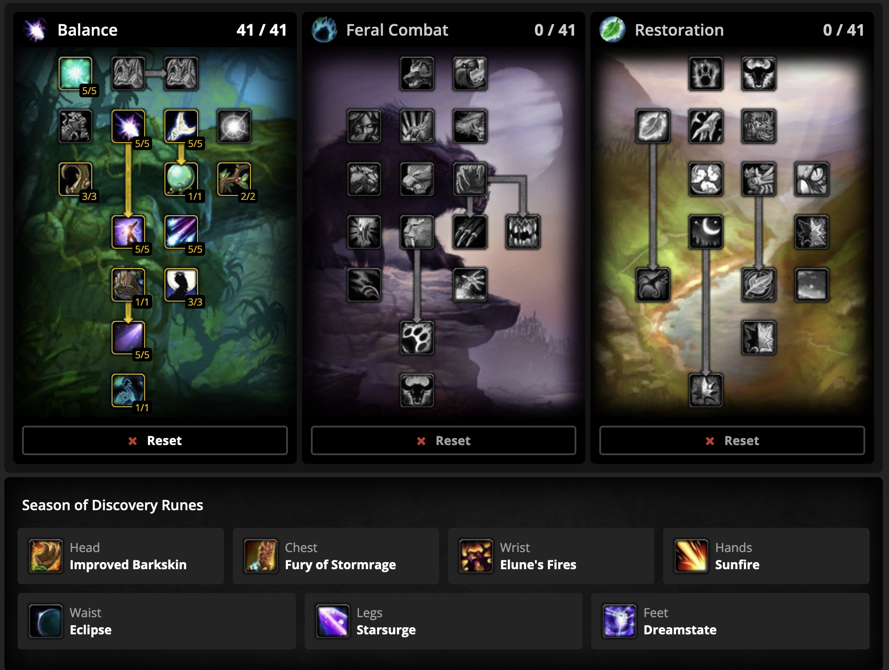

{: .no_toc }

This page presents information about the theoretical optimal way to play Balance Druid in Season of Discovery's Phase 3 raid,
Sunken Temple.

1. TOC
{:toc}

# Character Setup

## Sim / Stat Weights & EPs / Rotation
[Sim Link](https://wowsims.github.io/sod/balance_druid/#eJztVE9IFGEUnzezuzP7tm8dPwtnPzV1kRiG1mZHl1ohdhOCMCuJCK9FSpZRJFTetLI/ECh0ckNY6pB07BCxGohB/rnYIUVKSIKgP4e8dIgO9s3srI0t1CGjDr3DN/O+3++933vfPySKqIom7IKTMCRCs6yBDn0iUIEthjDQ1n2st+O8GtCsGjBGAEPqxxzR3ob0T7kI+tS5MYKyOvWEaCNJ/vN0jGjLYU7qGydaVtbnRiPcuTUM2quwvnrfdq5yyj1ZX+KOoi7OEf3xZ41P9487WQfGbM4V7gzK+iRHfOoLLuFT+ybt8euEPb50RJfmeaIAdx85hAd3iKUp/n3ipfAN8GdBHAWYAFgEnAax6ZoPl0Xhv/1Ro1n42yX8yj6IQrOchjYYAmgpS5immeBD3Eok4g2JeCzW0Ca1w3Hh1DO/JmE5BpmMfuX2Ad0fRVQwELPqk8keuoPFsJZWYygDfFL5ch10EVUjrPip9AYE5kcJoZGtYXQ7M7CSMgxmgJ9YxT7lJBrC4MOCyzD/pfwu0kMKsP2YorvXCxArZMO8oPetuuLogVfvx5Tf5atZFUZouQdEzIDsZmoS6BZWVgBfT7HD7pfuZAmsplVeMpYYRAlQscVVTTZTF1FFe7FQMs/00F52ETvpCa/gNqNOkaiaA0J9qqiBG8XCOVjXVpVRwZexmOeoWUWrHGfE3aE8nZqs3qnZI10cEyrE2MudYA24lVYWNsd+mYqaLM0D3h5Psy5sp0exzojyxkpysMkt2GEykgN0+spnrDQYr6GI9dOuZvbqstsVY5p3a9fVX8HWttOOcEAnlIPnpuGmeyk3pzMg3AUfE1GIzkrB/OzBdGkBjmSGbZtJJfMzz1O1nY4tpKyMpCxcJlRp7bjQ0V3TaGqNNZLx7t96UVf60xuSB7O/lUdlqxtTh8fizpgeTCe7zq4MzByZT+1xkXQ7fAOSEc4F){: .btn }

- The wowsims link is updated for the April 23rd balance change to natural weapons. I have confirmed it as a 10% modifier to total damage dealt, not only base damage

- Currently we are simming at about **1260dps on a 60 second fight** without demonic pact/PI/fist debuff (you can enable these under settings), but with most other buffs/consumes. The new dot extension rune is worth about +5% (60 dps).
  

- Darkmoon Card Decay was buffed April 9th. This was already simming as bis before the buff and now is reasonably ahead of other options. Sim is now updated, and seems to align with my early estimates on dps (druid sim does not have shadow weaving): ⁠sod-doomkin⁠

### Efficacy Points

The current Stat EP results are:

| Point       | Value                     | 
|:------------|:--------------------------|
| Spell Power | 1                         |
| Arcane      | 0.60                      |
| Nature      | 0.36                      |
| Hit         | 10.23 (up to a max of 5%) |
| Crit        | 7.11                      |
| Int         | 0.17                      |

{: .new-title } 
> What does this mean?
> 
> In BIS gear: 1 crit is the same damage increase as 7.11 SP,  1 Hit = 10.23 SP (up to 5%), etc.

{: .new-title }
> Why is 1 Arcane SP + 1 Nature SP =/= 1 SP?*
>
> Dragonbreath Chili (fire) and the new Atal'ai potion shadowbolt (shadow) both scale with spellpower.

### Rotation / Priority
I don’t think a static rotation is the easiest way to digest how to optimize damage this phase with desynced dot extension. Rather I would expect the following priority system is easiest to understand (this is exactly the same “priorities” as Phase 2):

Always be casting (i.e. never “wait” for something such as SS CD or dot refresh)
1. Use SS on CD, and use Starfire early enough to never delay a SS cast
2. Maintain dots
3. Fill with Wrath

I tested filling with Starfire instead of wrath and it is a small dps loss (and less mana efficient). Due to starsurge and Starfire generating 4 stacks of solar per 6 seconds, there still is no need to monitor eclipse stacks despite dot extension.

### Melee Weaving
Melee Weaving seems similar to Phase 2, where it is something you can use to get a bit of extra damage but will not be a massive dps increase.

Summary of weaving options (ranked):
1. Blade of Eternal Darkness + Minor Haste to gloves
2. Gizmo (from gnomer)
3. Best: Hubris (from ST) + Catnip

#### Notes of Melee Weaving in P3

- Catnip is added to the sim. I tested Nightmare Focus Staff and it is not a dps gain on 30 seconds with catnip active, but catnip should allow for melee weaving with hubris.
- The new mainhand from ST (Hubris) is currently only 1 spellpower above gizmo, so gizmo performs better for melee weaving when the encounter is above 40 seconds or so. The best mainhand for melee weave (and general damage) looks to be the updated Blade of Eternal Darkness; it is 1.5 speed to you will need to enchant gloves with minor haste.
- Melee weaving with Blade of Eternal Darkness provides marginal gains of ~40dps (~3% extra dps).
- Melee weaving will also increase the number of omen procs you can get.

{: .new-title }
> WTF is melee weaving?
> 
> It’s really easy, nothing like hunter melee weaving and the term honestly gives it a bad name. Just activate auto attack and stand in melee range, your character will automatically stab after instant casts before your next spell, if your weapon speed is less than 1.5. I use the following macro to make it easy:

{: .highlight }
> #showtooltip  
> /startattack  
> /cast Starsurge

### Multi Target Fights

I have embedded the APL logic for the below into the sim link into the pinned post. The sim will automatically update to the best option for that # of targets as you add targets on the “settings” tab. I have left it at 1 target in the default sim pin to avoid confusion (it is set to 4 in the below link).

[Multi-Dot Sim Link](https://wowsims.github.io/sod/balance_druid/#eJztVU1IFHEUnzezuzP7tlnHv4WzfzV1kRiG1nZHh1ohdhOCMCuJCK9FSpZRJFTe/Mg+IFDo5Ea01CHp2CFiNRCD1JMd0qSEJAj6OOSlQ3Sw/8zO6thCHdxIyHd4M+/93uf/Nx8oS7zCR2EPnIYhHhpFFTTo4YFwdDaAvpbOE91tFxWfalSBngIMKF8ysvohoH3NhNCjzIzKKCqTz2T1bpzdPB+V1cUgC+oZk9W0qM2MhJhxaxjUt0Ft+aFlXGUhD0RtgRmSMj8ja0+/qczdO2ZXHRi1YvqZMShqEwzxKK9YC4/SM2HpH+OWfmN7FmYt/cS+f3RHNlTJe4C/ErwB3jTwIwDjAPOAU8A3XPPgIs9tyl8VkoZ/PcKf5DPPNYpJaIEhgKYSMxqNmkzFDNOM1ZmxSKSuRWiFk9yZF15VwFL0UxG90u1DmjeMKKEvYtTG411kF41gNanEQAqYU/p+HTQeFT0oeYnwHjjqRQGhnq5gZCfVsZxQ9KfAhx7JesTlcAD9j3MmxeyVsBeRHJGAHsQE2bu2gWwELJgN9KlZk+x+4O73a8nV9pW0AkOk1AUipkB0KjVwZBstyYHvJulR50p2UxMrSYU7GIt0WfIRvsnpGm8kDqLw1mGhED3XRbrpZWwnp9wNd+g1kkCUDMjEo/AqOFk0mIE1a1XoZewY8+PsbkbeKceo7DCUDSdRWmvP7GqdnxPI5VjHbdI63E7Kc+RYn6W8JYuzgHvHs7QDW8lxrNHDbLGiDGxxBrYjqZwBtPfKVizXKZshL+q3W03v10RnK0pVN7Vr5i+jK3RaGTZopzLwwhTcdF7KrckUcPfBQ3nkwv2yP+s9nCzOwaHUsCXTiXjW8zJR3W7LXMJICdJcn0yk5rZLbZ1V9VG1vkrQP26sL+pSb7IgdTC9rjoKXS7MHC6J2To5mIx3nF8amD42m9jnIMlWMIYE6fUqOSYjR99gP7tCUdM3sq46haTGoeTeJiXrqrNJyar8b5T8BNOLAaI=){: .btn }

Multi target summary:

| Targets | DPS                                          | Explanation         | 
|:--------|:---------------------------------------------|:--------------------|
| 1       | 1260dps                                      | n/a                 | 
| 2       | 1315dps (+55)                                | Maintain dots on both targets, alternate starfires and wraths to maximize use of elunes fires |
| 4+      | 1240dps (-20)                                |  Simply dot 4 targets (tab target). Don't do this, it is mana intensive AND a dps loss from single target as it does not make any use of dot extension |
| 5+      | ~270 dps per target, so ~1350 at 5 targets   | At 5 targets and above, hurricane becomes bis with gale winds (~270 dps per target, so ~1350 at 5 targets)

I tested several methods for a 4 target multi dot. None outperformed the 2 target multi dot with elunes fires extension

To be more clear, max dps on 2-4 target: 
1. Moonfire on 2 target 
2. Alternate targets for SS/Starfire on CD > 2 Target Sunfire 
3. Alternate wrath target to extend Sunfire

## Gearing

### Best in Slot (BIS)

[See it on SixtyUpgrades](https://sixtyupgrades.com/sod/set/7E3YD8Zp7senHrSgeuDzkv){: .btn }

Some potential peplacement options:
- Dagger: Gizmoblade
- Trinkets: Combustion Chamber, Pearl
- Shoulders: Kinetic Amice
- Helm: Replace  with LW/Tailoring helm if you have
- Rings: WSG Ring, Band of Unicorn, Epic Gnomer
- Offhand: Enthralled Sphere (careful of 5% hit cap)
- Gloves: Dreamweave
- Wrist: Ornate Dark Iron Bangles (careful of 5% hit cap)

{: .highlight } 
Stuff like +8 int to leg/helm enchant is relatively unrealistic/expensive, especially for prebis but have listed them regardless. Int to legs and helm is worth almost no dps; do not prioritize it (I may just use 100hp to legs/helm, honestly).

### Pre-Raid Best in Slot (Pre-BIS)

[See it on SixtyUpgrades](https://sixtyupgrades.com/sod/set/4tRTdUfZFtmnaBSXTpiYW3){: .btn }

{: .highlight }
With the updates to the PvP set, it should sim very similarly to this PreBIS list to wear 6/6 (of the rank 7 gear). The advantage of this set is that you will have a lot more stats than prebis, particularly stam. The disadvantage is you will lose far more damage trying to replace pieces and break 6/6.

{: .warning }
Keep in mind some 60upgrades stats are not accurate to in game values, e.g. the 60Up 2pc bonus on leather set is wrong as of my last update.

### Princess Solo for Blade of Eternal Darkness

{: .warning }
> Make sure you have minor speed to boots for the below methods!

#### Princess only ~5 - 5.5min per clear

<iframe width="560" height="315" src="https://www.youtube.com/embed/XSn3BRu7xo4?si=7ETTM5twBS-ieDTK" title="YouTube video player" frameborder="0" allow="accelerometer; autoplay; clipboard-write; encrypted-media; gyroscope; picture-in-picture; web-share" referrerpolicy="strict-origin-when-cross-origin" allowfullscreen></iframe>

- Same as "method 1" below, just spamming r7 moonfire as mana allows, since I will innervate myself on princess.
- Why spam R7 Moonfire? The idea is that you keep the R8 Moonfire dot rolling and spam R7 for the instant damage, without affecting the dot timer. If you spam R8, the dot will not tick.

#### Method 1 Boomkin Wall Slide ~8.5 Min per clear (Princess + Dino)

<iframe width="560" height="315" src="https://www.youtube.com/embed/99HNXLLF4PY?si=JJ6bMpyeLSE3QTaN" title="YouTube video player" frameborder="0" allow="accelerometer; autoplay; clipboard-write; encrypted-media; gyroscope; picture-in-picture; web-share" referrerpolicy="strict-origin-when-cross-origin" allowfullscreen></iframe>

This is the fastest kill strat I have found so far and it feels consistent. It also can be done as a standard boomkin raid spec.

The method uses wall jumps around the room to kite her in circles. The wall jumps cause her to stutter and give you the ability to kite her. Keep up moonfire and use starsurge on CD. On EVERY spare global, use r1 moonfire (or max rank after a tick for extra damage).

It is important to use the r1 moonfire every spare global, especially when just landing from a jump. This appears to cause her to reengage and reduce the chance of resetting hp. It also keeps dreamstate mana regen up more regularly.

Don't jump during boulder cast. Getting hit mid air slow you down and if you get hit on the wall it will evade/heal her.

Dino is done with the same method but now you can also sunfire. I recommend using barkskin preemptively if he gets close.

Keep cat sprint for if she is catching you when you are going to cross the room. Nifty stopwatch and swiftness pots are also decent techs as backups for when you get in trouble.

#### Method 2 Feline Swiftness + Wall slide ~14 Min per clear (Princess + Dino)

<iframe width="560" height="315" src="https://www.youtube.com/embed/C0xz8VGX9IA?si=4aQ85VkF4jh-EAa3" title="YouTube video player" frameborder="0" allow="accelerometer; autoplay; clipboard-write; encrypted-media; gyroscope; picture-in-picture; web-share" referrerpolicy="strict-origin-when-cross-origin" allowfullscreen></iframe>

My princess strat (for chill/ez or learning). Disclaimer other methods can be faster but this is the one that worked for me to start, I haven't died since the first attempt.

This method uses these talents: makes stealth ez, shifting cheap, and running to princess quicker + felines for kiting: https://www.wowhead.com/classic/talent-calc/druid/500050300251134-055002_116xz56pr66y276v386pq96t1a6t0

The method uses wall jumping similar to method 1, but has cat as a fail safe.

I go cat any time she gets close to be safe, and I use cat form to cross in front of the giants safely. YOU CANT DIE RUNNING IN WIDE CIRCLES WITH CAT FORM (it just takes a long time if you use it too much).

This same spec lets you farm the devilsaur after for wild offerings. You can just run in circles and use Cat Sunfire (and anytime you are far enough, use moonfire/starsurge to speed up the kill and go back to cat).

#### General notes on Mara

- Speculation is now that the buffed drop rate for BoED as of April 16th is about 2%z
- The devilsaur has a “normal” leash and if you don’t hit him often enough will reset similar to non instanced mobs.
- You can reset the dungeon by logging out in the waterfall or center of the room (or water below, as long as your character is swimming it seems to work). This brings your character to the start of purple and you can zone out, reset and go zone in at the usual place).
- Credit to many people in the Druid discord, I just stole their strats and found my own versions.

### Gearing FAQs

{: .new-title }
> Why do you have fiery enchant?
>
> This is purely a melee weave thing; if you don't want to melee weave, just leave your weapon unenchanted (22 int does not appear to be attainable this phase).

{: .new-title }
> How do we value Roar of the Dream?
> 
> Things that proc Roar of the Dream:
> - Wrath
> - Starfire
> - Moonfire 
> - Sunfire
> - Atal'ai Mojo Shadowbolt
> 
> Things that do not proc Roar of the Dream:
> - Starsurge
> - BoED proc
> - Fiery
> 
> Differences to the sim assumption: 
> - Starsurge (-)  
> - Atal'ai Mojo (+)
> 
> Because Starsurge is ~25% of our casts and is not proccing roar of the dream, the sim assumes a much higher uptime than we are actually seeing.
> 
> - With sim assumptions, Roar of the Dream is worth ~18.5 spellpower
> - In practice, I would estimate Roar of the dream is worth ~14.5 spellpower

{: .new-title } 
> I don't want to farm BoED
> 
> It may be unrealistic to expect to farm Blade of Eternal Darkness, but it appears to have been buffed to a 2% drop rate. The best alternative is Gizmoblade from Gnomer. It sims 14 dps over Gizmo + some mana; Make your own decisions on if it is "worth"!

{: .new-title }
> Is the Sandstorm card any good?
> 
> Under ideal melee weave conditions it can be a slight dps bump to run DMC Sandstorm with Decay over the alternatives, but its pretty small (~10-15dps) and only when you can be in melee the whole time. I don't think I will personally pick up dunes deck unless the price comes way down.

{: .new-title }
> What if I don't want to PvP?
> 
> Alternate to the r7 shoulders would be subbing in the breadth of the beast trinket and picking up kinetic amice.

## Professions
Profession TLDR: Ench > Alch ~= LW > Others

Ench: +50 spellpower sigil

Alch: +30 spellpower flask, mildly irradiated potion

LW: Epic shoulders were recently updated.

TLDR Alch vs LW they are similar, LW performs best on 60 seconds with all CD available, otherwise Alch. More details: ⁠sod-doomkin⁠

Overview of other options:

Engi: Wrists are equivalent to WSG, but this still provides some goodies like goblin sappers, arcanite dragonling.

Tailoring: Worst of the 5 professions that provide a benefit.

## Consumes

Below is a list of consumes I plan to use. Some you might find to be too try-hard, but I have listed all regardless for completeness:

### General
- Greater Arcane Elixir
- Lesser Wizard Oil
- Superior/Major Mana Potions
- Demonic Rune
- Nightfin Soup (DME not open for int food)
- Atalai mojo of forbidden magic (very powerful, doesn’t stack with blasted lands)

### Engineering 
Ez Thro Dynamite II / Oil of Immolation / Dragonbreath chili (if melee weaving)

### Fight Specific
- Greater Nature Prot 
- Resto Pot
- Free Action Pot

## Talents

[See on WOWHEAD](https://www.wowhead.com/classic/talent-calc/druid/5000550312551351_116xz56pr66y276v386pq96t1a6t0){: .btn }

### Potential Changes
You can also drop 2 points from improved thorns and 3 points in moonglow for imp MOTW if it is not covered by another druid in your raid.

# Boss Strategies

Just kidding, sub to my onlyfans for the best boss strats!!!

